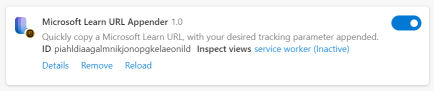

# Microsoft Learn URL Appender browser extension

This is a Chrome/Edge extension that allows you to do a one-time configuration to save a desired tracking parameter you would like appended to Microsoft Learn URLs, then easily copy the URL for any Microsoft Learn page, with previous tracking parameters replaced with your desired one.

## Installation

This extension is not yet available in the Chrome and Edge extension stores, so will have to be side-loaded. 

* [Here is a CNET article](https://www.cnet.com/tech/services-and-software/how-to-install-chrome-extensions-manually/) that explains how to sideload it into Chrome.
* [Here is a Microsoft Learn article](https://learn.microsoft.com/en-us/microsoft-edge/extensions-chromium/getting-started/extension-sideloading) that explains how to side load into Edge.

## Privacy and Permissions

There are no specific permissions you have to authorize for the extension to run, but the application itself uses the following Chrome permissions:

* **activeTab** - allows the extension to obtain the URL of the currently viewed web page after click on the extension icon
* **clipboardWrite** - allows the extension to put the URL into clipboard
* **contextMenus** - allows the extension to add 'Copy Page URL' and 'Copy Frame URL' items to the context menu
* **scripting** - ...
* **storage** - allows the extension to store extension settings in the browser storage
* **tabs** - ...

After clicking on the extension icon in the browser UI, or selecting the copy option in a right-click context menu, the extension obtains the URL of a currently viewed webpage or a webpage frame, optionally removes some parts of the URL, and places the URL into the clipboard. The extension does not handle the URL in any other way, and does not handle any other user data.

## Release notes

* **v1.0:** Released initial Chrome manifest v3 version. 

## Roadmap

* Allow for multiple inputs; and picker to easily toggle for which one they want.
* Upload to Chrome/Edge extension libraries.
* Add validation to not have it work on non-Learn sites.
* Strip locale during copy

## License

Code: [MIT](LICENSE)
